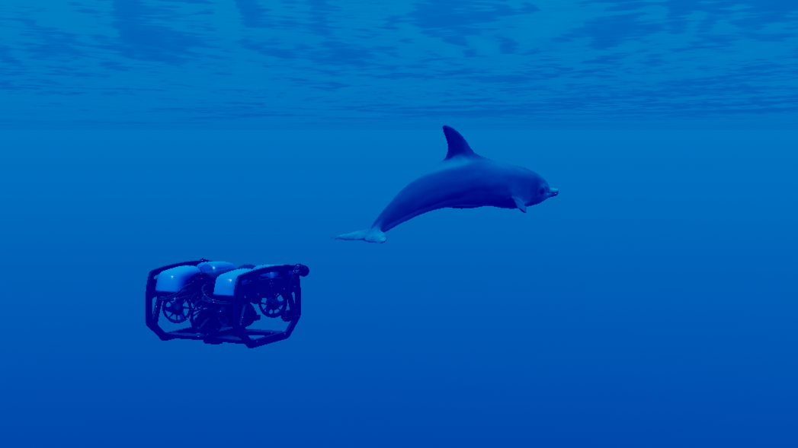

# SWiMM DEEPeR
A Simulated Underwater Environment for Tracking Marine Mammals Using Deep Reinforcement Learning and BlueROV2

<br>

Presented at [IEEE Conference on Games '23](https://2023.ieee-cog.org/)

### [Presentation]() | [Paper](https://ieeexplore.ieee.org/document/10333168)



## Prerequisites
- Linux or Windows
- Python 3.6.8
- Pipenv 2022.6.7

## Getting Started
### Installation and setup
- Clone this repo:
```bash
git clone https://github.com/SamuelAppleby/SWiMM_DEEPeR.git
cd SWiMM_DEEPeR
```

- Install required dependencies:
#### Linux
```bash
cd launchers
.\install_pip.bat
```
#### Windows
```bash
cd launchers
chmod +x pip_install.sh (Optional)
.\install_pip.sh
```

## Citation
If you would like to use this paper for research, please cite as:

```
@INPROCEEDINGS{10333168,
  author={Appleby, Samuel and Crane, Kirsten and Bergami, Giacomo and McGough, A. Stephen},
  booktitle={2023 IEEE Conference on Games (CoG)}, 
  title={SWiMM DEEPeR: A Simulated Underwater Environment for Tracking Marine Mammals Using Deep Reinforcement Learning and BlueROV2}, 
  year={2023},
  volume={},
  number={},
  pages={1-8},
  keywords={Training;Visualization;Target tracking;Oceans;Pipelines;Reinforcement learning;Games;Unity;active tracking;marine mammals;simulation environment;reinforcement learning;autoencoders},
  doi={10.1109/CoG57401.2023.10333168}}
```


## Acknowledgments
Samuel Appleby and Kirsten Crane would like to thank their supervisors: Giacomo Bergami and Steven McGough who provided invaluable guidance and feedback during the project.
